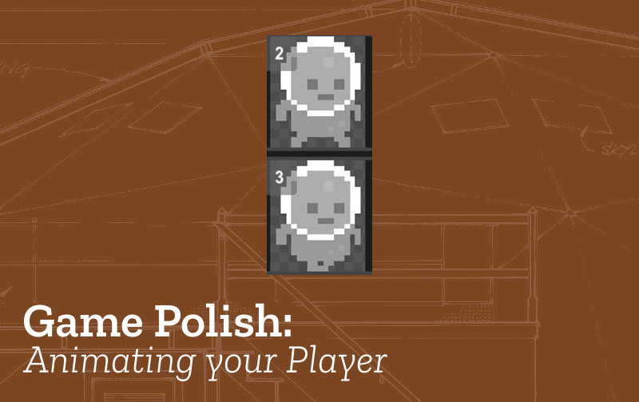

# Animate Player

* **Name:** Animate Player

* **Description:** The player is animated using different 'frames'.

* **Need for Pattern:** This movement helps create a sense of dynamic movement and can help the game player's immersion in the game.

* **Related Game Patterns:** Add Static Enemy [needed before adding this one], Jumping on Enemies [related]

* **Coding Concepts involved:** [Data](learningDimensions#data)

* **Links to other Computing Patterns:** , [Change Listener](learningDimensions#change-listener)

## How to implement this Pattern in MakeCode

### Simple Animation of Player

We will create a simple animation using different frames of our player.
To allow us to do this  go to  **Advanced > + Extensions > Add Animation**
Drag in the animation block that you see below.

Click on the frames image to change the different frames of your animation, then interval
to update how quickly the frames update and finally turn loop on so the animation keeps running.

### Animated Walking and Jumping using Animation States
See the following https://makecode.com/_ecqJXwWrpJXw

To create more authentic animations which change the direction of the player, show them walking and still when not
moving we will use an animation with states. To start we will have three simple states moving **Left**, moving **Right**
and not moving i.e. **Idle**

To start create an function to create our animation, call it createAnimations and then add a block to call it at the end of your on start loop.

Now fill up the createAnimations block. To start add one animation which animates our player as then move to the left.
To allow us to do this make sure you can add animation blocks go to  **Advanced > + Extensions > Add Animation**.
Then add the blocks as per the screenshot below.

I have added simple two state animations by selecting different versions of a character from the Gallery. You can create your own
animated player by drawing.
Be sure to change your starting image too at the beginning of your on start loop

Now repeat the pattern for the moving right and not moving / idle states.

We have now to activate those animations create some code in a on **game update** loop that will be always running and listening
for changes in conditions. We can use the players velocity in the x -axis to decide if they are moving left or right or not moving.

## Test your Changes and Next Steps

Test your game to check that your changes have the desired behaviour and that there are no side effects.

To check that you are making the most of this pattern you can ask yourself the following questions:

* Is your animation smooth? Do you need to add more frames?
* Do you want to add more states for jumping?

This Game Pattern is one of many allowing you to make improvements to your platform game and to learn coding and wider computing concepts.
Find more on the [Game Pattern page](gamePatterns.md).
